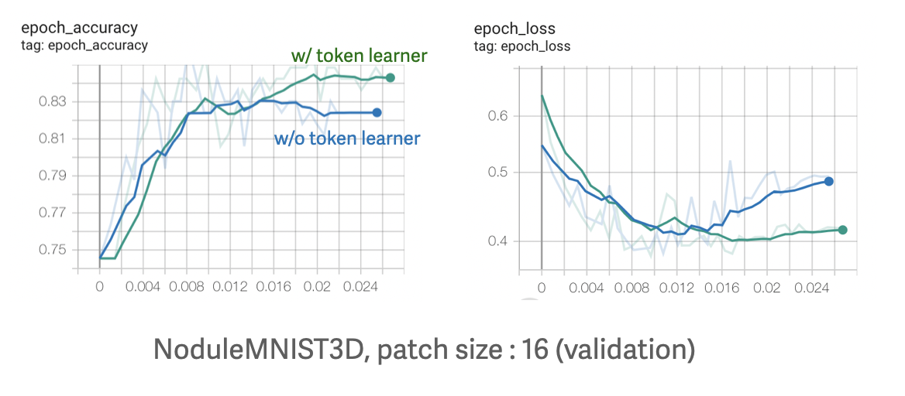
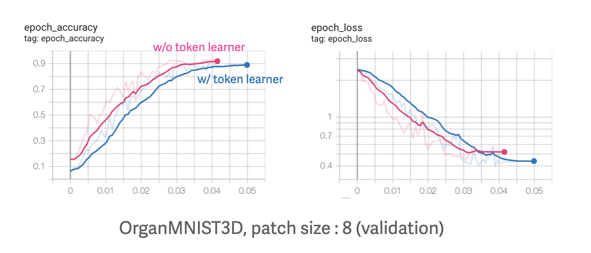

# Vision Problem Solvings

Solutions for Computer Vision problems.

## 1. ViViT 

### 1.1. Video classification with ViViT

This notebook is a trial of [ViViT(Video Vision Transformer)](https://arxiv.org/abs/2103.15691) model. 

The dataset used is SynapseMNIST3D of [MedMNIST3D](https://medmnist.com/), where each data is a sequence of synapse images representing 3D volume. The data samples are displayed inside the notebook with Jupyter Widget.

#### Inference 

  

These are some of the samples from inference.

### 1.2. ViViT with/without Token Learner

This notebook explores the effect of [**Token Learner**](https://proceedings.neurips.cc/paper/2021/file/6a30e32e56fce5cf381895dfe6ca7b6f-Paper.pdf) put in ViViT. 

The datasets used for training are from [MedMNIST 3D](https://medmnist.com/), which contains medical 3D images with different types of classes. The model structure was tested on patch size 8 and 16, and token learner was put in the middle (half point of the transformer blocks). AdamW optimization method was used for regulralization and the learning rate was reduced on plateau.

#### The Result

 

 

The overall performance of the model with token learner was better than the naive model in validation accracy and loss over epochs. Also, there was no signs of overfitting with token learner even though the training time was shortened. The result shows that with token learners models learn faster, without significant risk of overfitting.

All of the result graphs are displayed on [TensorBoard](https://tensorboard.dev/experiment/nYVP58K4Q1GEuWLbkWBFow/). 

